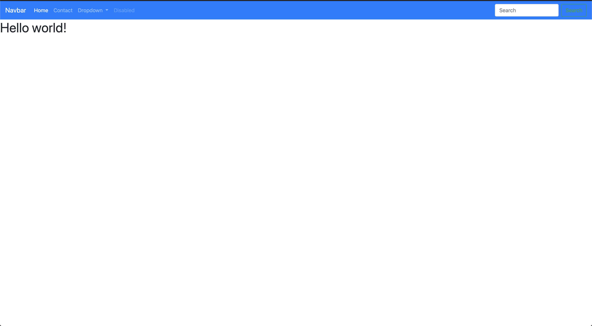

# My Personal Portfolio Site

## Description 

This is my portfolio site, designed to meet the criteria for GT Full-stack Flex program homework requirements.

It is built using Bootstrap CSS, and customized based on design mockups provided in class. 

## Table of Contents

* [Installation](#installation)
* [Usage](#usage)
* [Credits](#credits)
* [License](#license)

## Installation

1. Clone the repo
2. Open index.html in default browser. 

## Usage 

[Deployed Portfolio Site](https://jonathanjwatson.github.io/gt-hw-bootstrap-portfolio/)

## Credits

This site was designed by the curriculum team. The design was provided to me. 

Credit to the Twitter Bootstrap team for designing an awesome CSS Library. 

## License

MIT

## Contributing

We are not currently accepting contributors at the moment. 

